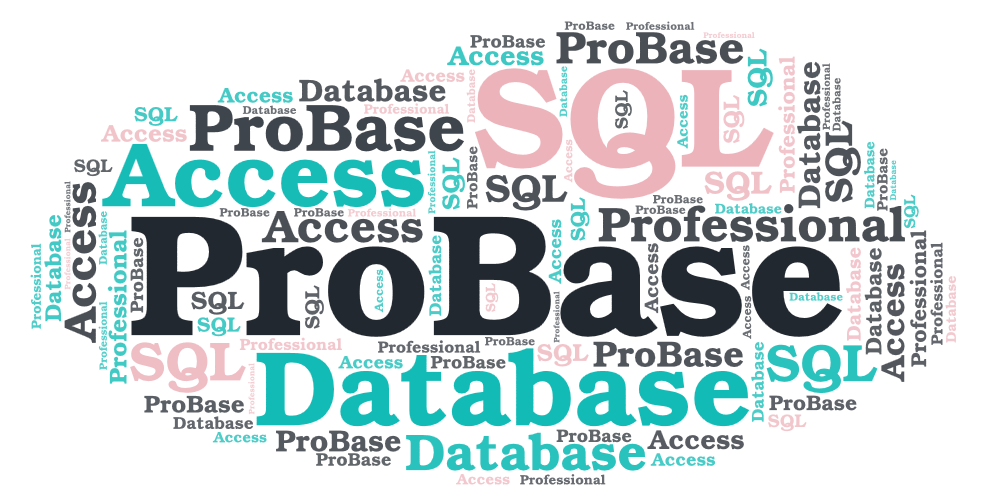

# ProBase

[](https://dev.azure.com/Alexandru-Istrate/ProBase/_build/latest?definitionId=2&branchName=develop)

ProBase is the new way of accessing databases in C#. Unlike any other strategies like using query strings directly in the code or using an ORM, ProBase alows you to communicate with a database by using the most flexible and safe system - stored procedures. What ProBase adds on top of the classic ADO.NET data primitives is the ability to generate procedure calls based on annotated methods, thus allowing you to call a procedure in the same way you would call a method.



## Example
Firstly, you need to define a type that maps each method to its database procedure counterpart. Because all of the database access logic is handled by ProBase, the type has to be an interface so it only contains the signatures of the methods:

```csharp
[DbInterface]
interface IDatabaseOperations
{
    [Procedure("CreateItem")]
    void Create(object item);

    [Procedure("ReadItem")]
    object Read(int id);

    [Procedure("UpdateItem")]
    void Update(int id, string item);

    [Procedure("DeleteItem")]
    void Delete(int id);
}
```

In the snippet above, you can see that we have a bunch of attributes applied. The one applied to the interface (```DbInterface```) specifies that the interface is to be used for interfacing with a database. This is a required attribute and must be present on any interface you want to use with ProBase. The attributes applied to each method are ```Procedure``` attributes which specify how a certain method maps to a procedure. In the example above you can see that the argument passed into the attribute constructor is the name of the procedure this method maps to.

Once we have our mappings set up, we can create an instance of this interface on which we can call the actual methods. For this we need to create a ```GenerationContext``` object passing in a ```DbConnection``` to the constructor. With the object created, we can invoke the ```GenerateOperations``` method that takes in the type of the operations class and returns an instance of that class with all of the database access logic implemented for us:

```csharp
SqlConnection connection = new SqlConnection(connectionString);

GenerationContext context = new GenerationContext(connection);
IDatabaseOperations operations = context.GenerateOperations<IDatabaseOperations>();
```

With the ```IDatabaseOperations``` object created we can begin calling methods which in turn will call the database procedures they are bound to:

```csharp
operations.Create("Hello, World!");
operations.Read(id: 5);
```

## Built With
- C#
- .NET Standard
- ADO.NET
- NUnit

## Releases
This package is available on NuGet.

## Building From Source
In order to build ProBase you need:
- Visual Studio
- .NET Framework 4.8 or .NET Core 3.1

## Disclaimer
- The main image is made using [WordArt.com](https://wordart.com)
